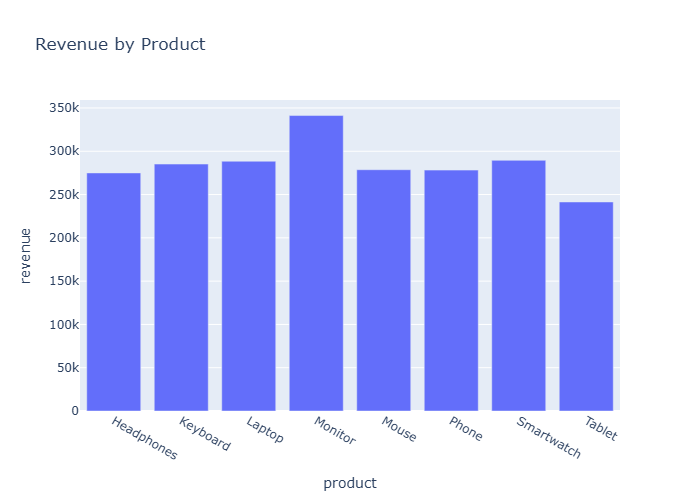
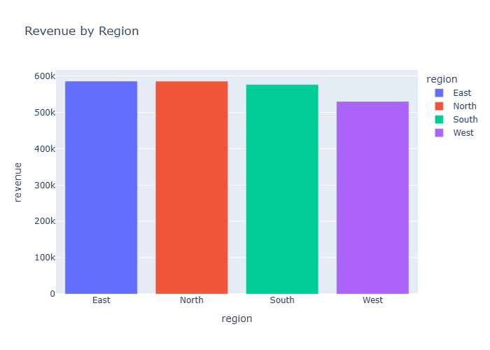
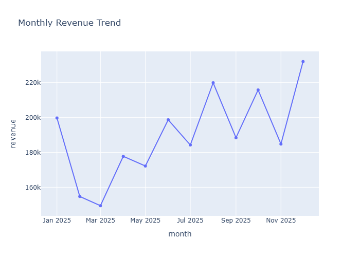

# Sales Analytics Platform

A complete sales analytics dashboard analyzing product performance, regional sales, and revenue trends for a fictional retail company.

## 🛠️ Tech Stack
Python, Pandas, PostgreSQL, Plotly, Streamlit

## 📊 What it does
Generates and analyzes synthetic sales data, answering key business questions about top products, regional performance, and seasonal trends. Includes an interactive region filter.

## 🎯 Key Insight
Monitor is both the highest revenue and highest unit-sales product. December showed the strongest monthly revenue, suggesting strong seasonal demand requiring careful stock planning.

## 📈 Visualizations

## 🚀 Run it locally
\`\`\`
git clone [repo-url]
pip install -r requirements.txt
streamlit run sales_app.py
\`\`\`